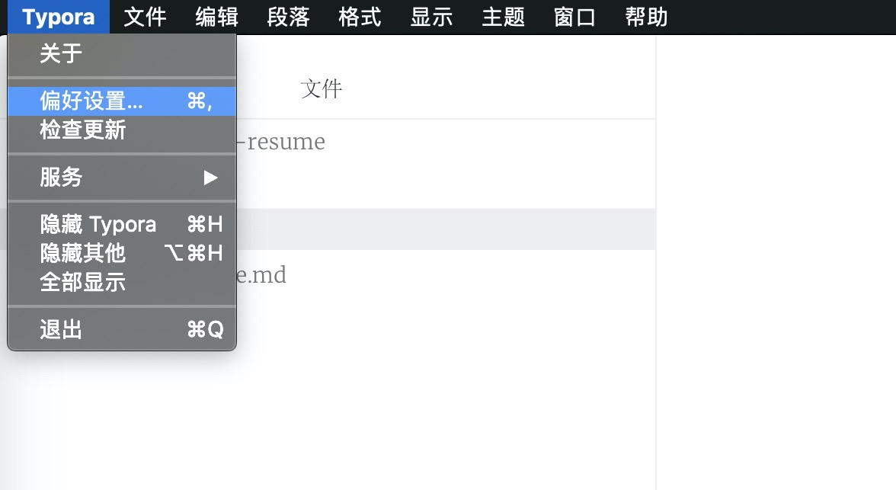
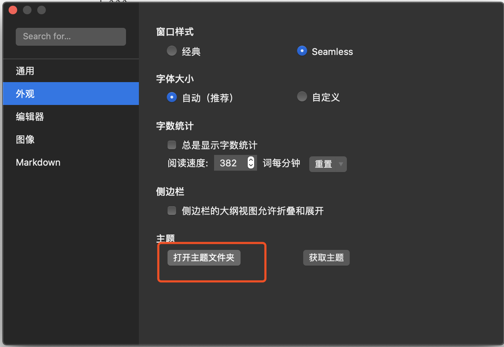
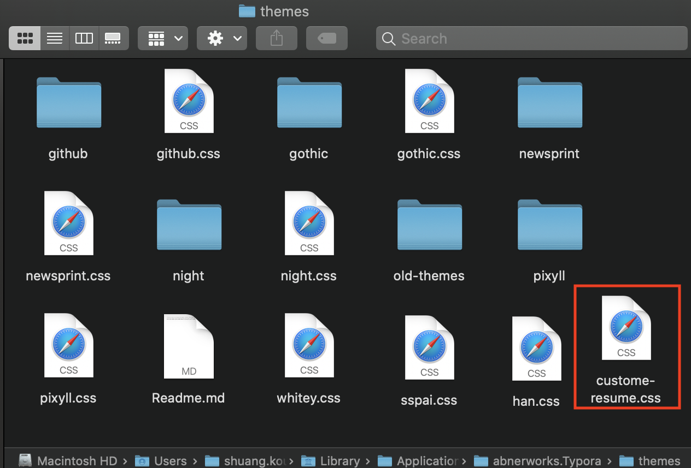
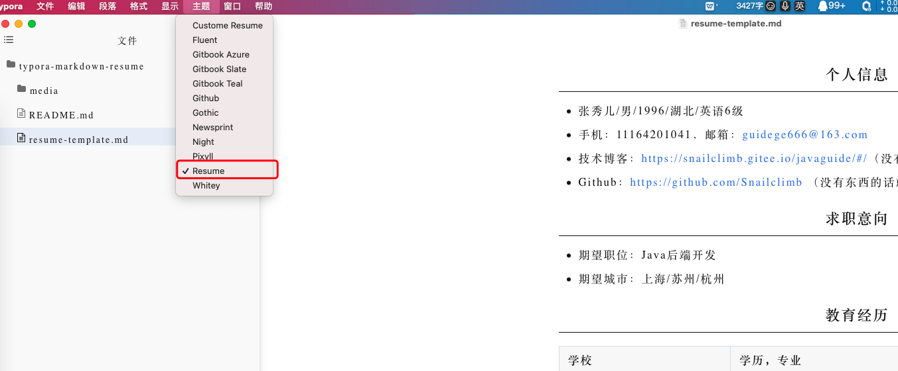
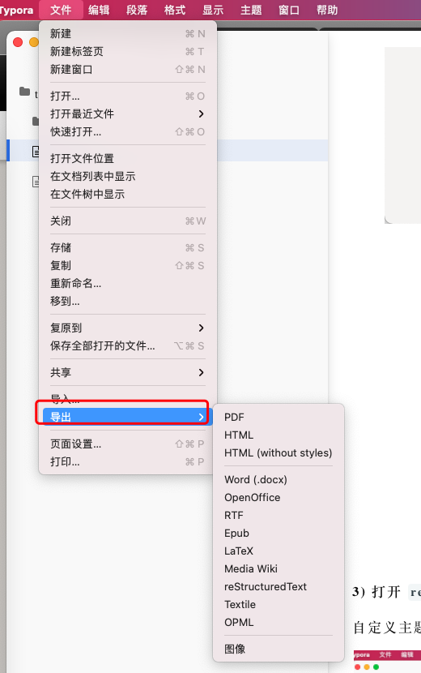
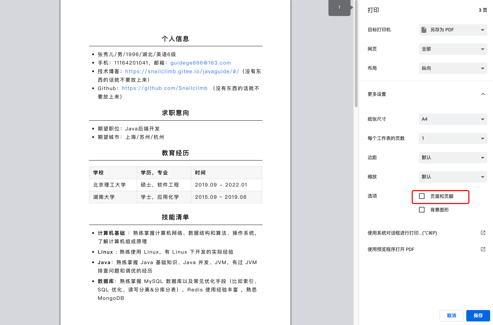

# typora-markdown-resume

自定义 CSS 简洁大方的 Markdown 简历模板。具体实现效果如下：

### 如何使用？

**1)下载 [Typora](https://typora.io/)**

**2)将文件夹下的 `resume.css`移动到 Typora 自带的主题文件夹**

**3) 打开 `resume-template.md`，然后选择我们的自定义主题即可**

自定义主题添加完之后，重启 Typora 你就可以看到我们自定义的主题了。

**4)导出 HTML**

建议导出 HTML，直接导出 PDF 会出现一些小问题。

**5）本地打开 HTML，然后使用 Ctrl+P(Win)/Command+P（Mac） 将 HTML 另存为 PDF。**

不要勾选页眉页脚。

