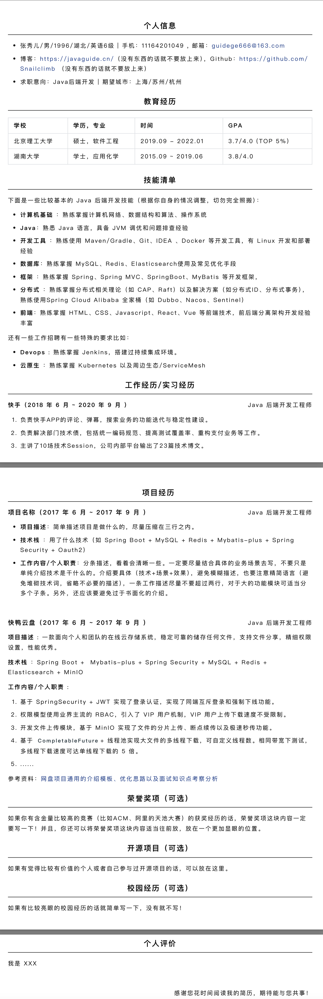
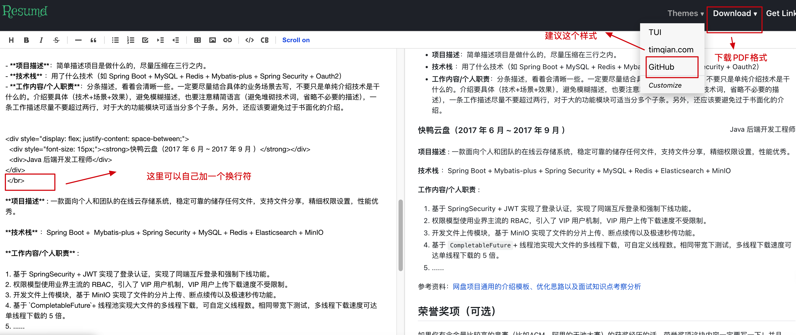
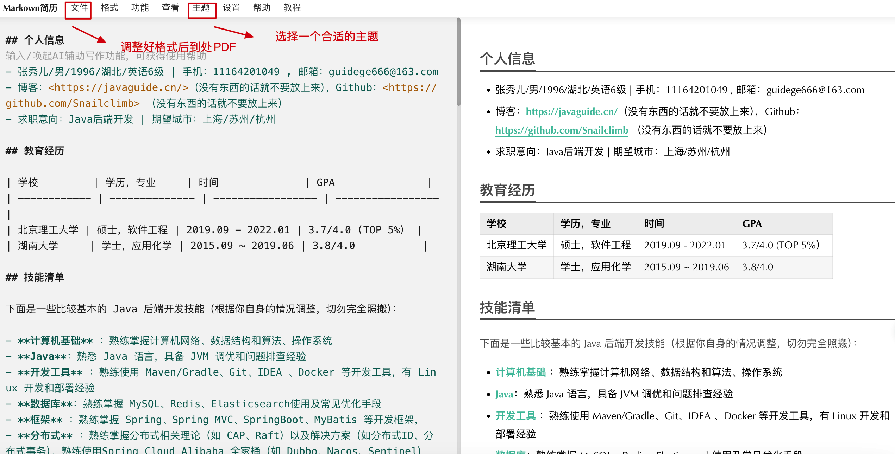

这是一个 Markdown 版本的简历模板，可以拿来参考或者直接使用。

**效果如下**：

## 如何使用？

由于现在 Typora 需要收费，因此很多人现在已经不用 Typora了。这里个人建议选择其他在线 Markdown 简历排版工具，然后结合我提供的简历模板去导出一份适合自己的简历。

例如，**https://resumd.t9t.io/** 这个在线排版工具。

直接将 Markdown 格式的简历内容复制过去，选择 “Github 主题”，然后下载 PDF 格式即可。

**https://mdnice.com/** 这种 Markdown 排版工具也可以，但需要自己调整一下正文字体大小。

如果你有 Typora 的话，也可以按照下面的方式到处简历。

**1、下载 [Typora](https://typora.io/)**

**2、将文件夹下的 `resume.css`移动到 Typora 自带的主题文件夹**

**3、 打开 `resume-template.md`，然后选择我们的自定义主题即可**

自定义主题添加完之后，重启 Typora 你就可以看到我们自定义的主题了。

**4、导出 HTML**

建议导出 HTML，直接导出 PDF 会出现一些小问题。

**5、本地打开 HTML，然后使用 Ctrl+P(Win)/Command+P（Mac） 将 HTML 另存为 PDF。**

不要勾选页眉页脚。

