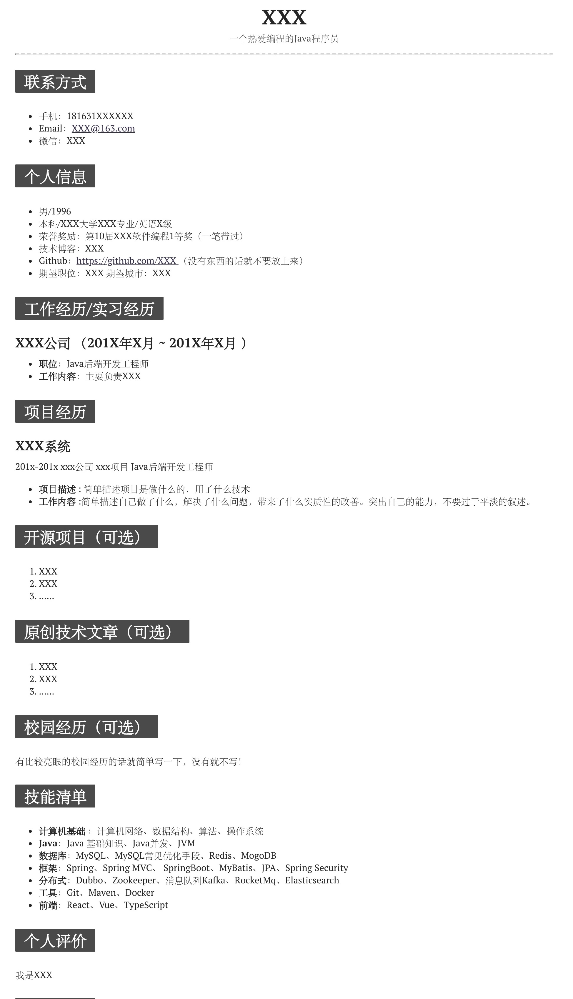
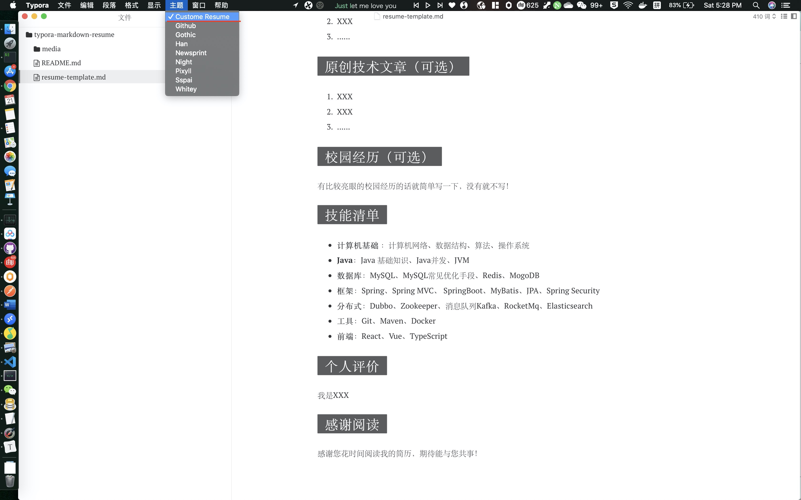

# typora-markdown-resume

自定义 CSS 简洁大方的 Markdown 简历模板。具体实现效果如下：

### 如何使用？

1)下载 [Typora](https://typora.io/)

2)将 `custome-resume.css`移动到 Typora自带的主题文件夹

3) 打开 `resume-template.md`，然后选择我们的自定义主题即可

自定义主题添加完之后，重启 Typora 你就可以看到我们自定义的主题了。

